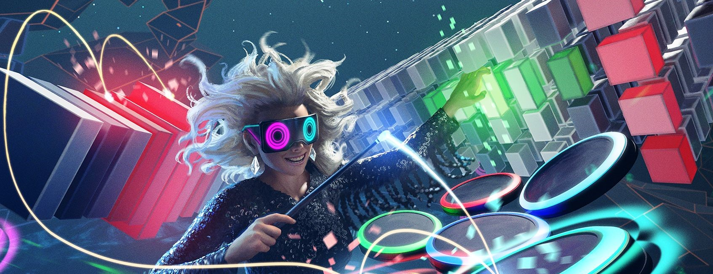
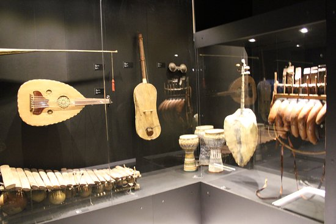
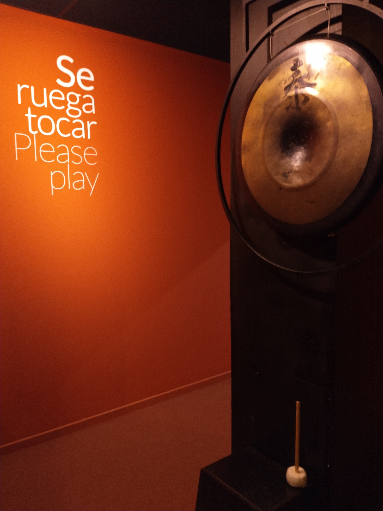
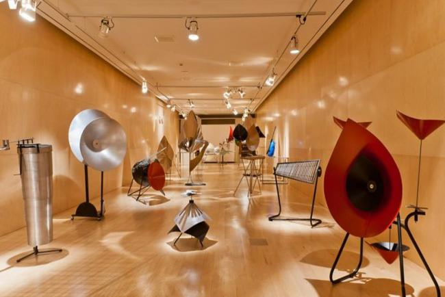
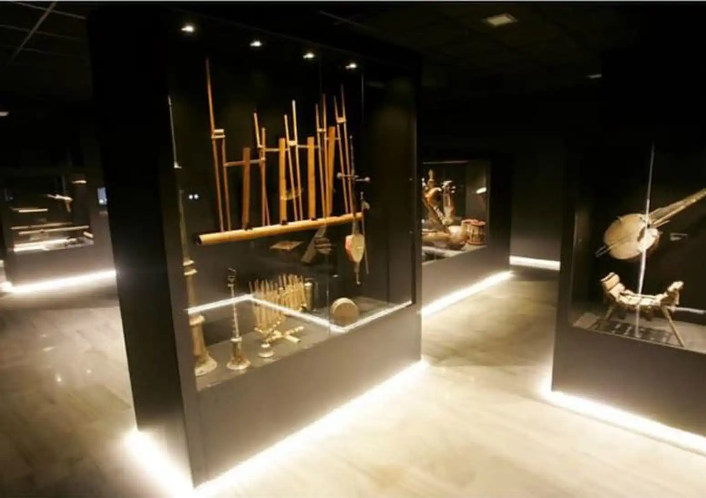

# Museo Sonoro · Portal Inmersivo


Portal web del **Museo Inmersivo de la Música**, un recorrido RA/RV que guía a estudiantes, familias y público general por cinco salas temáticas con mapas históricos, líneas de tiempo interactivas y reproductores de audio narrados por Orfeo.

## Tabla de contenido
- [Características principales](#características-principales)
- [Salas y páginas](#salas-y-páginas)
- [Recursos visuales](#recursos-visuales)
- [Estructura del proyecto](#estructura-del-proyecto)
- [Guías de audio y personalización](#guías-de-audio-y-personalización)
- [Ejecutar el sitio en local](#ejecutar-el-sitio-en-local)
- [Accesibilidad y buenas prácticas](#accesibilidad-y-buenas-prácticas)
- [Equipo](#equipo)

## Características principales
- **Experiencias multimodales**: cada sala combina storytelling histórico, líneas de tiempo 3D, mapas interactivos y prácticas VR/AR descritas en los paneles.
- **Reproductor personalizado**: `scripts/audio-player.js` ofrece visualizador Web Audio con degradados, control por teclado y fallback cuando se usa `file://`.
- **Guías narrativas**: Orfeo acompaña cada sala con pistas de audio 8D distintas (cuerda, percusión, viento, producción y dirección).
- **Diseño adaptable**: `estilos-mapas.css` unifica tipografía, gradientes y layouts responsive para escritorio y tablets.
- **Modo museo/doméstico**: la landing (`index.html`) explica cómo alternar entre visitas libres, recorridos guiados y recompensas presenciales.

## Salas y páginas
| Sala / Página | Archivo | Qué muestra |
| --- | --- | --- |
| Portal principal | `index.html` | Concepto general, ventajas RA/RV, lista de salas y equipo responsable. |
| Instrumentos de cuerda | `cuerda.html` | Línea temporal desde liras sumerias a guitarras eléctricas, mapa de luthería y reproductor dedicado. |
| Percusión global | `percusion.html` | Cronología de rituales, mapa de difusión y minijuegos colaborativos descritos. |
| Vientos del mundo | `viento.html` | Evolución de flautas, shofares y saxos con prácticas respiratorias y audio inmersivo. |
| Laboratorio de producción | `produccion.html` | Revoluciones tecnológicas, hubs urbanos y estaciones VR para mezcla y síntesis. |
| Dirección orquestal | `direccion.html` | Historia del gesto, mapas de podios y práctica de batuta con feedback visual. |

## Recursos visuales
| Landing y RA/RV | Instrumentos | Producción |
| --- | --- | --- |
|  |  |  |

| Percusión | Viento | Dirección |
| --- | --- | --- |
|  |  |  |

_Añade o reemplaza imágenes en `img/` para mantener la documentación actualizada._

## Estructura del proyecto
```
mapas/
├── audio/                 # Guias narradas por Orfeo
├── img/                   # Collages y referencias visuales
├── scripts/
│   └── audio-player.js    # Reproductor accesible con visualizador
├── estilos-mapas.css      # Tema y componentes compartidos
├── index.html             # Portal de acceso
├── cuerda.html
├── percusion.html
├── viento.html
├── produccion.html
└── direccion.html
```

## Guías de audio y personalización
- Cada página enlaza su pista dedicada (por ejemplo `audio/orfeo - percusion.wav`).
- Los nombres deben coincidir exactamente con los que aparecen en `audio/README.txt` para evitar rutas rotas.
- Sustituye un archivo WAV por otro con la misma duración aproximada para conservar la sincronía con las visualizaciones.
- El visualizador se desactiva automáticamente si sirves el sitio con `file://`; utiliza un servidor local para mantener las animaciones del canvas.

## Ejecutar el sitio en local
1. Sitúate en la carpeta del proyecto.
2. Lanza un servidor estático (cualquier opción es válida; ejemplo con Python):

```powershell
cd C:\Users\semai\Desktop\mapas\mapas
python -m http.server 5500
```

3. Abre `http://localhost:5500/index.html` en tu navegador.
4. Para una edición rápida desde VS Code puedes usar la extensión **Live Server**, que refresca automáticamente las páginas.

## Accesibilidad y buenas prácticas
- Soporte para `prefers-reduced-motion`: el visualizador cambia a línea base si el usuario lo solicita.
- Controles de audio con estados `aria-label`, timeline navegable con teclado y botones con foco visible.
- Mapas y líneas de tiempo incluyen pistas de texto con `aria-label` para lectores de pantalla.
- Estructura semántica basada en `section`, `article`, `nav` y `footer` para mejorar SEO y accesibilidad.

## Equipo
- Rubén García · Campo de aplicación y audiencias.
- Sento Marcos · Tecnología VR/AR y visualización.
- Jordan Phillips · Plataforma y seguimiento.
- Rogers Sobrado · Salas de instrumentos.
- Carla Rumeu · Producción y dirección.
- Rocío Piquer · Participación, accesibilidad y cierre.

> Proyecto realizado para la asignatura **Diseño de Sistema Virtual 2025/2026**.
